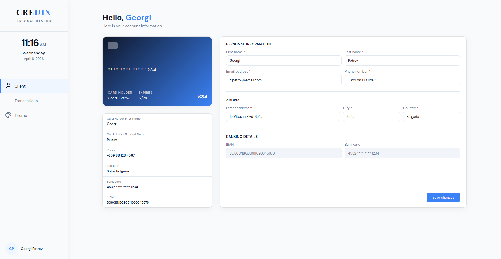
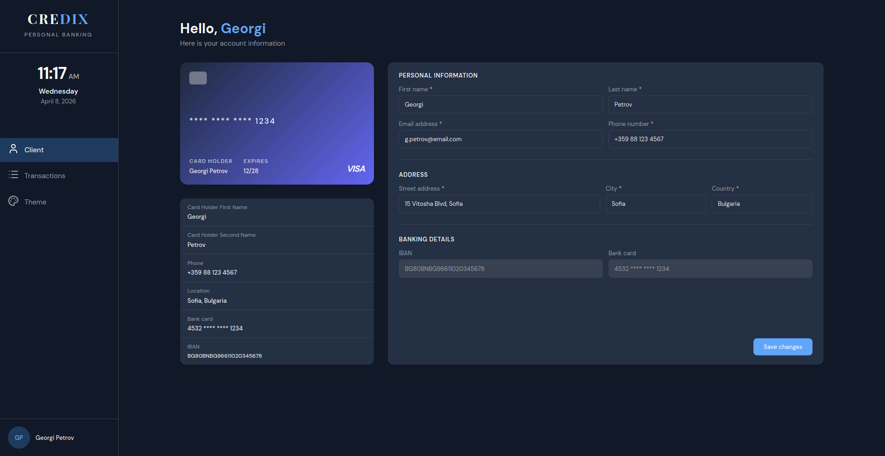
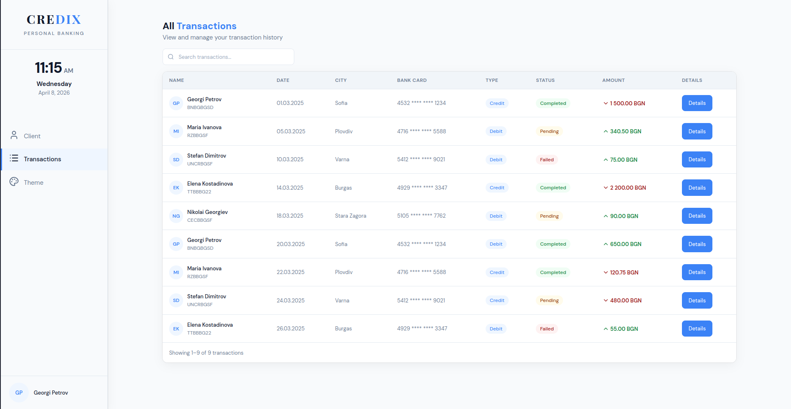
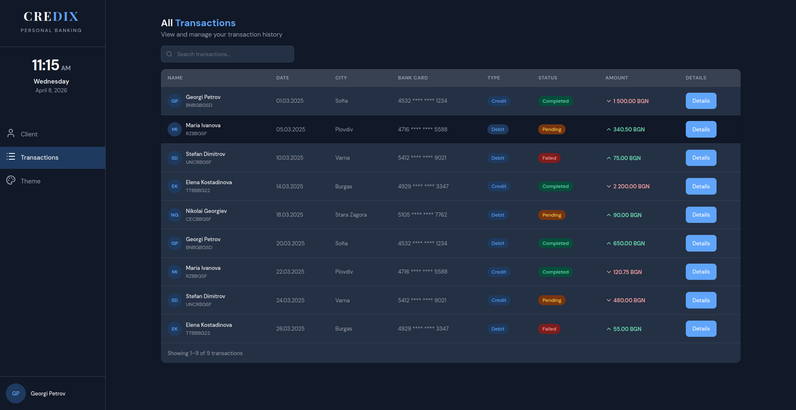
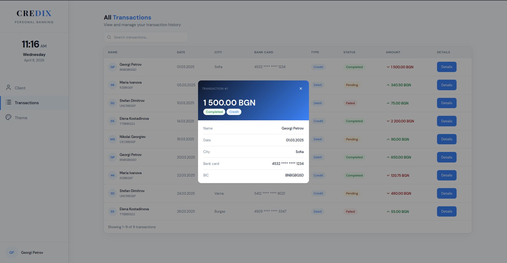

# Credix — Personal Banking Dashboard

A two-page banking application built as a take-home assessment for CODIX.

## Live Demo

[https://codix-home-task.netlify.app/client](https://codix-home-task.netlify.app/client)

## Screenshots

### Initial Design


<table>
  <tr>
    <td></td>
    <td></td>
  </tr>
  <tr>
    <td></td>
    <td></td>
  </tr>
  <tr>
    <td></td>
    <td></td>
  </tr>
</table>

## Getting Started

### Prerequisites
- Node.js (v18 or higher)
- Angular CLI

### Installation

```bash
npm install
```

### Running the project

```bash
ng serve
```

Then open your browser at `http://localhost:4200`.

## Angular Version

This project was built with **Angular 21** using standalone components.

## Technical Decisions

The application has two pages — a Client Profile page and a Transactions page.

For the client form I wanted to avoid hardcoding fields directly in the HTML, so I created a config file where each field carries its label, type, readonly state, and validation rules. The template just loops over it. This made it easy to add or change fields without touching the HTML at all. Validation uses Angular's built-in directives and errors only show after the user has interacted with a field, which felt like the right UX decision. Edits are saved to localStorage so nothing gets lost on refresh.

The transactions page has a search bar that filters by name and status, a modal for viewing transaction details, and three custom pipes — one for formatting amounts, one for European date format, and one for generating initials from a full name. For the theme toggle I went with a simple approach: a ThemeService adds a `dark` class to the body, and all colors are CSS variables so the whole app responds instantly. No component libraries were used anywhere — everything is plain CSS.